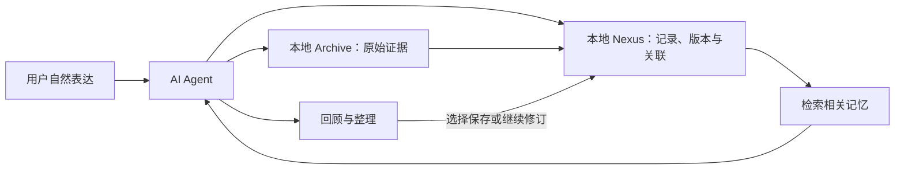

# nexus

**永久个人记忆基础框架**

v0.1.0 · MIT · [English](README_EN.md)

Nexus 为个人 AI 提供长期记忆的持久层。

接入 AI Agent 后，你可以用自然语言记录经历、想法、人物和生活片段，不必每次都先决定分类、填写字段，或把内容整理成完整文章。Nexus 保留原始表达、记录来源和版本，使这些零散内容能够在以后被检索、关联，并由 Agent 按你的需要重新组织。

**随时表达，长期保存；需要时找回，需要时整理。**

## 本地数据声明

**Nexus 采用本地存储。原始文字、记录、关联和版本保存在本地；图片等原始附件由配套的本地 Archive 保全。整理后保存的内容也回到本地，而不是依靠聊天平台的上下文长期留存。**

本地存储与模型处理是两个不同的环节：

- **使用云端模型时**，Agent 为理解、检索和归纳而提供给模型的相关内容，会发送到对应的云端服务。本地保存不等于整个处理过程都不出本机。
- **使用本地模型时**，可以通过接入的 Agent 和本地推理服务，在本机处理这些记忆。文字需要相应的语言模型，图片理解需要具备视觉能力的模型。
- **不接入模型时**，仍可以使用底层存储与查询接口；自然语言理解和通用内容归纳需要由其他程序或人工完成。

Nexus 本身不调用云端大模型，也不内置模型推理引擎。数据是否外发，取决于你接入的 Agent、模型服务和其他组件的配置。

对于重视隐私的用户，本地模型是一条可选择的路径。Nexus 的存储层基于 SQLite，本身较轻量；本地模型需要多少内存、算力和存储空间，则由具体模型与推理方式决定。

## 记忆可以先是零散的

个人记忆往往没有整齐的结构。

它可能是一次旅行中的见闻、一段与朋友的交流、关于同事的印象、一条工作思路，也可能是碎碎念、梦境、感受，或暂时说不清意义的一句话。

Nexus 的通用记录模型可以承载这些内容。消费、任务和日程是其中具有专门字段的扩展，其他表达也可以作为有来源的文字记录保存。

记录时不必把所有东西一次整理好。暂时无法确定分类或归属的内容，可以先保留；以后理解更清楚了，再补充关联或追加修订。

梦境、感受、转述和推测也需要保留各自的性质，而不是混成确定发生的事实。

## 从无序表达，到有序整理，再继续积累

Nexus 希望支持一种持续循环：

**自然表达 → 零散积累 → 检索关联 → 按需整理 → 新的表达与补充 → 再次整理**

整理不是记忆的终点。

一份已经整理好的资料，仍然可以接收新的片段、补充和纠正。新的内容也不必立即融入完整叙述；当你再次需要回顾时，Agent 可以根据当前记录重新组织答案，并核对原始来源。

Nexus 保留这个过程中的依据与历史，让记忆能够不断生长，而不必反复推倒重来。

它希望让人达到的状态是：

**表达时少一些整理负担，回顾时多一些可找回、可理解、可追溯的记忆。**

## 它可以帮助你做什么？

- **自然记录**：通过接入的 Agent 表达想保存的内容，降低每次记录时的整理负担。
- **长期找回**：按关键词、人物关联、主题档案或可确定的时间范围，查找已经保存的资料。
- **回顾与归纳**：让 Agent 从检索到的零散记录中整理时间线、主题脉络或阶段回顾，并在需要时核对原话。
- **持续补充与纠正**：给旧记录补充理解、调整归属或修正内容，同时保留此前的版本和证据。
- **追溯整理依据**：区分原始表达、结构化记录和后续解释，知道一个结论从哪里来。

这里的“快速”，首先意味着用自然表达降低记录和查找的操作负担。实际响应速度仍取决于模型、接入方式和数据规模。

## 一个例子：一年后，重新理解一次旅行

旅行期间，你陆续记录：

> “今天在星湾岛看到了蓝色风筝。”
>
> “和朋友聊了很久，突然想到以后想学摄影。”
>
> “昨晚做了一个关于海边小屋的梦。”
>
> “这段经历让我想起以前的一件事。”

这些内容并不是一篇游记，也不需要当场写成游记。

当记录已经关联到同一次旅行的档案，一年后，你可以对接入的 Agent 说：

> “帮我整理出星湾岛这次旅行的内容，看看发生了什么，以及当时有哪些想法。”

Agent 可以调用 Nexus 检索相关记录、展开原始证据，再按经历、人物交流、感受和想法组织回顾。

之后你仍然可以补记：

> “我现在想起来，那段关于摄影的想法还有一个原因……”

记忆由此继续积累，下一次回顾也可以形成新的整理结果。

同样的过程也适用于一个持续多年的兴趣、一段人际交往、反复出现的想法，或某个阶段的生活回顾。

*以上地点与表达均为虚构示例。*

## 为什么要保留原文和历史？

归纳会改变内容的组织方式，理解也会随着时间变化。

Nexus 保留原始来源，并让修改形成新的版本。这样，你既能看到当前整理后的资料，也能回到当时的表达，分辨后来补充了什么、纠正了什么。

对于文字，原话是证据；对于图片，原始字节是证据。模型生成的描述、识别结果和解释属于派生内容，不能替代原件。

长期记忆因此拥有可以回查的依据，而不只是不断被改写的摘要。

## Nexus、Archive 与 AI Agent

三个部分各自承担不同职责：

| 部分 | 职责 |
|---|---|
| Archive | 保全原始事件、文字和附件，提供来源与完整性校验 |
| Nexus | 保存记录、版本、证据和关联，提供长期持久化与检索 |
| AI Agent | 理解自然表达，提出记录或修订，检索相关内容并组织回答 |



Agent 可以使用云端模型，也可以接入本地模型。Nexus 为它提供独立于当前聊天会话的记忆基础。

本仓库包含 Nexus 核心、OpenClaw 适配器和 Archive 读取契约，不包含完整的 Archive 采集服务。

## 记忆怎样进入 Nexus？

1. 用户自然表达，Host 与 Archive 保存可信来源。
2. Agent 提出保存内容，Nexus 核验来源、身份和证据。
3. 原文形成 Source，整理后的内容形成 Item 与 Revision。
4. Evidence 将记录版本连接到原文；Relation 将相关记录连接起来。
5. 后续检索返回有限候选，需要时展开原文核对。
6. 补充或纠错追加新版本，保留之前的内容与依据。

来源暂未就绪时，系统可以进入持久等待与重试。明确记录请求也有原话保留路径；原话已保存与结构化已完成，会分别说明。

## 核心数据模型

| 结构 | 用途 |
|---|---|
| Source | 原始文字及来源信息 |
| Item | 一条资料的稳定身份 |
| Revision | 内容与理解的历史版本 |
| Evidence | 支撑某个版本的原文片段 |
| Relation | 人物、事件、主题档案与记录之间的关联 |
| Entity Alias | 人物或实体的别名 |
| Operation | 已提交操作与幂等结果 |

任务、财务和日程提供额外的结构化明细。主题档案帮助组织相关记录；汇总版本清单用于追踪内置汇总所依据的记录版本。

这些结构服务于长期记忆的保存和回查，而不要求用户直接操作数据库字段。

## 当前实现与边界

**已经实现：**

原文与证据保存、追加版本修订、对象关联、人物别名、主题档案、分页查询、关键词检索、结构化明细、事务与幂等、持久等待与恢复，以及一致性备份校验。

**需要 AI Agent 配合：**

自然语言理解、通用内容归纳、文字回顾与图片理解。当前开源版不内置独立的大模型或通用归纳引擎；使用本地模型需要在 Agent 侧配置相应服务。

**仍有限制：**

当前检索主要依靠关键词、结构化条件与明确关联，没有内置语义向量检索。能够回顾的范围取决于内容是否已保存、来源是否保全，以及检索是否足以定位它。

Nexus 不保证自动找齐所有相关历史，也不会把“没有检索到”解释为“从未发生”。归属不明确时，需要进一步检索或澄清。

当前适配器的提示与部分规则主要为中文。开源版没有内置 UI、自动人物合并、数据库加密或主动记忆推送。

## 快速开始

当前公开版本是从实际运行系统抽取的参考实现。快速开始使用全新虚构数据，不读取现有个人资料。

需要 Python 3.10+，以及支持 JSON 和 FTS5 trigram 的 SQLite。

```sh
git clone https://github.com/yyyx5/nexus-personal-memory.git
cd nexus-personal-memory

python3 -B scripts/demo.py
python3 -B -m unittest discover -s tests -v
python3 -B scripts/privacy_audit.py
```

接入真实 Agent 时，使用 `config/settings.example.json` 配置独立运行目录、来源与授权身份。真实配置和数据应保存在仓库之外。

参见 [接入说明](docs/integration.md)。

## 隐私与数据控制

个人记忆属于用户自己的本地资料。

真实数据库、原文、图片、聊天记录、附件、身份名单、日志、备份和凭据不应进入源码仓库。公开示例必须重新编写为虚构数据，不能直接使用真实记录作简单脱敏。

本地存储减少了对外部聊天平台长期保管记忆的依赖，但它本身不是加密措施。设备权限、备份安全，以及 Agent 和模型的数据流向，仍需要按自己的隐私要求配置。

对于高隐私需求，可以采用本地模型与本地配套服务，并核验整个处理链路是否存在外部调用。

## 项目目录

```text
nexus/      核心存储、查询与 OpenClaw 适配器
schema/     SQLite Schema 与 Archive 契约
docs/       架构、接入、隐私与维护说明
examples/   完全虚构的示例
config/     配置模板
tests/      隔离功能与安全回归
scripts/    Demo 与隐私检查
```

## Contributing

欢迎改进适配器、检索能力、测试与文档。

请使用虚构案例，不要在 Issue、PR、截图或测试中上传真实个人记录、身份信息或凭据。修改应保留原始证据、历史版本与明确的能力边界。

参见 [贡献说明](CONTRIBUTING.md)。

## License

[MIT License](LICENSE)。

## 畅想计划

下面是 Nexus 对未来的一些设想。它们可能逐步实现，也可能调整或不实现，供讨论与参考，**不属于当前版本的功能承诺**。

### 一、连接 Obsidian：让人生记忆成为人能够阅读的资料

Nexus 与 Obsidian 可以承担不同的角色：

**Nexus 面向 AI 的保存与调用；Obsidian 面向人的阅读、浏览与编辑。**

Nexus 保留经历、表达、来源和变化过程。Obsidian 则可以将这些资料呈现为更适合人阅读的笔记、时间线、人物页面和主题文章。

未来，希望用户继续通过 Nexus 自然记录，而不必同时维护另一套笔记。想回顾时，或者每个月、半年、一年，可以让 Agent 基于 Nexus 整理内容，生成供 Obsidian 阅读的知识库。

它可以是一段时期的生活回顾，也可以是一次旅行、一段关系的发展，或一个想法逐渐形成的过程。

**Nexus 负责“记住事实”，Obsidian 负责“把人生呈现出来”。**

这里的“记住事实”也包括忠实保留“当时做了一个梦”“当时有这样的感受”“当时听到了这段转述”，同时分清表达本身与外部事实。

呈现出的文字应能够回到原始依据。后续补记或纠错，也应有机会反映到新的整理结果中，而不是让知识库成为一次导出后就不再变化的副本。

### 二、主动记忆推送：在合适的时候，找回可能有帮助的过去

现在主要是用户提出问题，再检索记忆。

未来，希望探索另一种方式：在用户允许的范围内，通过定时任务或近期输入触发检索，主动整理一些值得回顾的片段。

例如：

- 最近反复提到一个想法，而过去曾留下相关的思考。
- 当前正在经历的事情，与以前某段经历有值得比较的地方。
- 一些分散在不同时间的记录，逐渐形成了同一个主题。
- 用户曾写下一个愿望，后来又留下了与它有关的新进展。

系统可以把这些线索组织成一条简短提醒、一段回顾，或一个供用户思考的问题：

> “你最近提到的这个想法，和过去的一段记录可能有关。要不要一起看看？”

这种推送希望帮助用户理解自己的人生、思想、情绪与感受，让个人 AI 的回应更有连续性，也更贴近用户的表达。

这里的“更懂你”和“共情”，指的是根据用户留下的内容，给出有依据、有分寸的回应。系统提出的关联与解释仍然是推测，不能替用户认定感受，也不能把模型生成的想法变成用户自己的历史。

如果未来实现，用户应能够选择关注主题、推送频率与触发方式，查看依据，并随时暂停或关闭。

**让过去的记忆，在当下需要的时候，重新变得有意义。**
