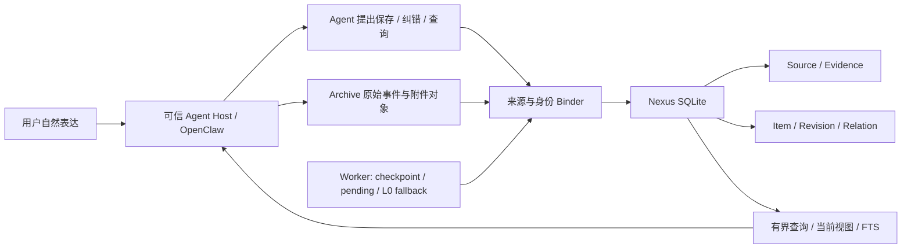

# Nexus — 个人记忆基础设施

**Nexus — Personal Memory Infrastructure · v0.1.0 · MIT**

Nexus 是面向 AI Agent / 个人 AI 的长期记忆与个人资料持久化系统。本版从一个实际使用的个人生产系统中逐项抽取通用实现，提供可运行、可研究的开源参考实现。生产数据、私人配置和归档不在仓库内。[English](README_EN.md)

用户自然表达，Agent 提出结构化记录；Nexus 校验可信来源、保留原文与证据、追加版本、建立关联并提供有界检索。存储服务本身不调用 LLM 或 embedding。**快速开始运行的是全新虚构数据，不接入任何现有账号。**

## 为什么需要 Nexus

聊天上下文会增长、压缩和被重置；摘要容易丢失原话、时间、归属与修订理由。传统 Memory 文档适合偏好和背景，但很难精确回答“这个金额来自哪句话”“更正前是什么”“汇总基于哪几个版本”。

Nexus 把长期资料放在独立持久层：稳定对象身份、不可变来源、逐版本证据、当前视图与有限查询。它不会把 AI 推断、计划、转述或主观感受自动提升为确定事实，也不把“未找到”当成“从未发生”。

## 设计理念

- 原始证据先于结构化结论；OCR/vision 是派生解释，不能替代原图。
- 修改追加 Revision，保留旧版本；Item 的 head 指向当前版本。
- 事件发生时间与收到消息时间分开；没有明确时间时保持未知。
- 关联依附版本，金额使用整数最小货币单位；报价、预算、承诺与已入账分开。
- 保存成功以事务提交为准；pending 或 fallback 不冒充完整结构化。
- Life / Work / Health / Unclassified 固定四类；健康默认 restricted，普通查询不展开。

## 架构



Archive 保存原始事件、字节对象与哈希；Nexus 保存可修订的结构化资料及证据指针；AI Agent 理解自然语言并组织答案。本仓库包含 **Archive 读取、校验契约与虚构生产器**，不包含生产 Archive corpus，也不包含完整 Archive 采集 daemon。

OpenClaw 专用部分是 `index.ts`、`binding.py`、`transcript.py` 和 worker 的 transcript 扫描。SQLite 数据模型、版本机制、证据校验、事务、档案和查询可供其他 Agent 复用，但必须实现可信 Host/Archive 适配，不能让模型自己声明身份。参见[接入契约](docs/integration.md)。

## 数据模型

| 结构 | 含义 |
|---|---|
| `source` | 不可变原文、内容 SHA、来源事件、Archive SHA 和 selector |
| `item` | 稳定 ID 与当前 `head_revision_id` |
| `revision` | 版本号、父版本、正文/payload、归类、断言属性、状态与哈希 |
| `evidence` | Revision → Source 的原文连续区间与 supports/corrects/context/contradicts 角色 |
| `relation` | 每个 Revision 的对象关系，如 `for_group` / `summary_of`；兼容 `for_trip` |
| `entity_alias` | 每个实体版本的别名；支持查询，不自动合并人物 |
| `operation` | 请求哈希、提交结果、幂等操作键 |
| `task_detail` | open / done / cancelled / paused 及原始到期表达 |
| `financial_detail` | 整数金额、币种/精度、方向、booked/quote/budget/commitment |
| `schedule_detail` | 原始时间表达、可确定日期；取消通过 deleted Revision |
| `pending_intent` / `origin_item` / `worker_checkpoint` | 持久重试、原话升级映射、扫描水位 |
| `group_context` / `summary_manifest` / `migration` | 24 小时会话档案上下文、汇总成员版本清单、迁移校验 |

[Schema 与迁移说明](docs/data-model.md)。Schema 文件是基础 v1；附加 v2/v3 表在 `groups.py` / `completion.py` 初始化，版本发布号 v0.1.0 与数据库迁移号无关。

## 保存、纠错与检索

1. Host 持久化真实入站事件；Archive 保全原始事件和附件。
2. Agent 使用六个固定工具提出保存/纠错/检索，参数不包含可自行指定的来源身份。
3. Binder 校验 owner、Agent、账户、私聊、session、精确工具调用祖先与 Archive 哈希。
4. SQLite `BEGIN IMMEDIATE` 原子写入 Source、Revision、Evidence、Relation、类型明细和 Operation；错误整体回滚。
5. 返回真实提交回执。来源还未落盘则进入 pending，worker 有界重试；明确记录前缀可 L0 原话 fallback，稍后结构化升级同一 Item。
6. 纠错需要 `item_id` + `expected_revision` + reason；旧版本和旧来源保留，当前金额从当前有效明细计算。

检索工具包括 `nexus_search`、固定模板 `nexus_query`、`nexus_get_source` 和只预览的 `nexus_delete_preview`。另两个工具是 `nexus_save`、`nexus_update`。

当前工具搜索主要是有界子串查询；基础存储另有 FTS5 trigram 索引和 `Nexus.search()` 路径。档案/日期查询提供总数、分页与快照游标，记录变化后游标失效。实时财务合计不受展开页数影响，文字汇总保存成员版本清单，明细变化时标记过时。Archive 历史检索只展开少量已核验原文，不加载整个归档到 prompt。这里没有语义向量检索引擎。

## 完全虚构的示例

星湾岛是为本项目编造的地点，所有表达、金额、时间、渠道身份和 metadata 都重新创建：

- “记一下，2030年4月12日去虚构的星湾岛旅行，建立星湾岛旅行档案。” → Source / Evidence → 档案 Item。
- “记一下，星湾岛旅行午餐花了42元。” → 新 Item / Revision v1 / `for_group` / 4200 minor units。
- “生活随手记，星湾岛旅行看到了蓝色风筝。” → 日常记录，通过另一个虚构渠道访问共享库。
- “刚才星湾岛旅行午餐不是42元，改为38元。” → 原 Item 的 Revision v2，旧 42 元保留，新增 corrects Evidence。
- 查询旧旅行 → 分页记录、来源、关系；当前合计 3800，旧汇总标记过时。

[`scripts/demo.py`](scripts/demo.py) 在临时目录建立虚构 transcript 和 Archive，走真实 Binder 与 Core；输出版本、证据、关联和检索结果后自动删除。示例中的 proposal 是人工编写，**没有演示自动 LLM 提取**。

## 快速开始

Python 3.10+，SQLite 需支持 JSON 和 FTS5 trigram（SQLite 3.34+）。POSIX worker/备份使用 `fcntl`；Windows 原生 worker 尚未验证。Demo 和测试没有 Python 第三方依赖。

```sh
git clone https://github.com/yyyx5/nexus-personal-memory.git
cd nexus-personal-memory
python3 -B scripts/demo.py
python3 -B -m unittest discover -s tests -v
python3 -B scripts/privacy_audit.py
```

Demo 验证结果应为 `errors: []`，当前虚构午餐合计为 3800 minor units。测试覆盖两渠道、来源拒绝、篡改、原话升级、重启补偿、回滚、幂等冲突、历史、健康隔离、分页和一致性备份恢复。

## 配置

`config/settings.example.json` 是模板，owner 名单默认空，默认拒绝访问。真实配置保存到仓库外独立运行根的 `state/settings.json`，数据库位于该根 `data/nexus.sqlite3`。`sourceDB` 指向 Host 的 transcript SQLite，`archiveRoot` 指向兼容 Archive；两者须使用绝对路径。`agent` 与 `account` 独立校验，owner 按渠道配置。

OpenClaw 适配器通过 `NEXUS_ROOT` 获取独立运行根，可用 `NEXUS_PYTHON` 指定 Python。压缩 transcript 需要系统 libzstd，可用 `NEXUS_ZSTD_LIBRARY` 指定共享库；纯文本 Demo 不需要。模板不是一键生产部署配置；初始化水位和接入验证步骤见[接入文档](docs/integration.md)。不要使用本项目覆盖既有生产目录或打开历史全量自动提取。

## 隐私设计

数据库、WAL/SHM、Archive、原文、附件、日志、备份、`.env`、身份名单和私人配置不进入 Git。运行数据留在仓库外；SQLite 文件权限 0600、进程 umask 077，来源读取 `mode=ro` / `query_only`，模型不能提供源路径/身份字段。

Source、Revision 等由 SQLite trigger 阻止原地修改，SHA 用于一致性检测；**不是加密、数字签名或防数据库拥有者篡改的保证**。restricted 是应用查询策略，不是数据库加密；健康识别/归组和日期守卫仍有启发式限制。此实现用于单人可信本机，不能直接作为多租户公网服务。[隐私与发布审计](docs/privacy.md)。

## 当前功能与边界

**已实现并在本版虚构测试验证：** source/evidence/revision/关系、批量事务、幂等、乐观并发、L0 fallback、pending 持久恢复、共享双渠道存储与 owner 否定校验、档案分页、整数财务统计、快照过时检测、FTS、一致性备份及恢复验证。

**实验性 / 需要接入验收：** OpenClaw SDK 插件入口、依赖 Host 事件结构的工具祖先绑定、AI 自然提取与图片派生信息、中文启发式意图/归组、有限 Archive 历史检索、固定旧表列选择器。插件曾用于来源生产环境，但本版已通过现有官方 SDK 加载与双渠道 mock 注册检查，但未安装到用户的 OpenClaw，也未对真实渠道做新部署端到端测试。

**限制：** 没有独立自然语言解析器、UI、自动提醒、通用文件导入器、自动人物合并、数据库加密或内置向量库；不能恢复部署前丢失的原件。长会话仍可能产生大上下文、多轮调用；Archive 搜索扫描文件，尚未证明大规模性能。当前提示和回执主要为中文，英文 README 不代表完整英文运行行为。

## 目录

```text
nexus/      核心 Python、OpenClaw 适配器、工具参数定义
schema/     SQLite 基础 Schema 与 Archive JSON 契约
docs/       模型、接入、隐私、提取来源与维护说明
examples/   全新虚构事件/归档生成器
config/     默认拒绝的配置模板
tests/      独立临时目录功能与安全回归
scripts/    Demo 与提交/历史隐私检查
```

## Roadmap

更清晰的 Host 适配接口、可配置语言/时区策略、独立 Archive 采集包、更多接入兼容性测试、通用导入选择器、可选语义检索与 UI。这些是规划，不属于 v0.1.0 已实现承诺。

## Contributing

提交可复现的虚构案例与测试；不要在 issue、PR、截图或测试 fixture 中上传真实个人数据或凭据。遵循 [CONTRIBUTING.md](CONTRIBUTING.md)，修改前审阅来源提取清单与同步规则。现有生产测试和私有验收材料不随仓库发布。

## License

[MIT License](LICENSE)。未捆绑 OpenClaw 或 libzstd 的第三方代码；它们是外部运行依赖，遵守各自许可证。[来源与第三方边界](docs/provenance.md)。
