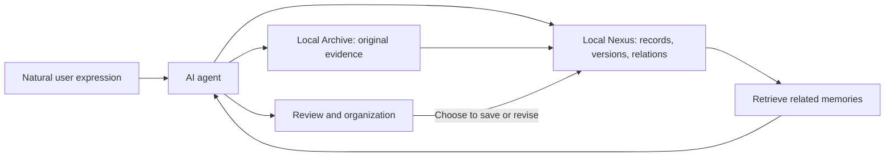

# nexus

**Permanent Personal Memory Framework**

v0.1.0 · MIT · [中文](README.md)

Nexus provides a persistent layer for long-term personal AI memory.

With an AI agent connected, you can record experiences, thoughts, people, and moments from your life in natural language. You do not have to choose a category, fill in fields, or turn every entry into a finished essay. Nexus preserves original expressions, sources, and versions so these scattered fragments can later be retrieved, connected, and organized by the agent when you need them.

**Express yourself whenever you want. Keep memories over time. Retrieve and organize them when you need to.**

## Local data statement

**Nexus uses local storage. Original text, records, relations, and versions remain local; original attachments such as images are preserved by a companion local Archive. Organized content that you choose to save is also stored locally, rather than relying on a chat platform's context for long-term retention.**

Local storage and model processing are separate parts of the system:

- **With a cloud model**, the relevant content that the agent supplies for understanding, retrieval, and synthesis is sent to that cloud service. Local storage does not mean that every processing step stays on your machine.
- **With a local model**, a connected agent and local inference service can process these memories on your machine. Text needs a suitable language model; image understanding needs a model with vision capabilities.
- **Without a model**, the underlying storage and query interfaces remain usable. Natural-language understanding and general synthesis must be handled by another program or by a person.

Nexus itself does not call cloud language models or include a model inference engine. Whether data leaves your machine depends on the connected agent, model service, and other components you configure.

For privacy-conscious users, a local model is an option. Nexus's SQLite-based storage layer is relatively lightweight; the memory, compute, and disk requirements of local inference depend on the model and inference setup.

## Memories can start as fragments

Personal memories rarely arrive in a neat structure.

They might be observations from a trip, a conversation with a friend, an impression of a colleague, an idea about work, a passing thought, a dream, a feeling, or a sentence whose meaning is not yet clear.

Nexus's general record model can hold these kinds of content. Expenses, tasks, and schedules are extensions with dedicated fields; other expressions can also be saved as text records with provenance.

You do not have to organize everything at the moment of recording. Content with an uncertain category or connection can be kept first, then linked or revised as your understanding develops.

Dreams, feelings, hearsay, and speculation retain their own nature instead of being mixed together as confirmed events.

## From scattered expression to organized memory, and onward

Nexus aims to support a continuing cycle:

**Natural expression → scattered accumulation → retrieval and connections → organization on demand → new expressions and additions → organization again**

Organization is not the end of a memory.

An organized collection can still receive new fragments, additions, and corrections. New content does not have to fit into a finished narrative immediately. When you want to revisit it, the agent can reorganize the current records and check their original sources.

Nexus preserves the evidence and history of this process so memory can keep growing without having to start over each time.

The experience it aims to support is:

**Less organizing work when you express yourself; more retrievable, understandable, traceable memories when you look back.**

## What can it help you do?

- **Record naturally:** tell the connected agent what you want to preserve, with less preparation for each entry.
- **Retrieve over time:** find saved material by keywords, person-related links, topic dossiers, or supported date ranges.
- **Review and synthesize:** ask the agent to turn retrieved fragments into a timeline, thematic account, or period review, checking original wording when needed.
- **Add and correct continuously:** extend an earlier record, change its association, or correct its content while preserving previous versions and evidence.
- **Trace the basis of an account:** distinguish original expressions, structured records, and later interpretations, and see where a conclusion came from.

“Quick” primarily means reducing the effort of recording and finding information through natural expression. Response time still depends on the model, integration, and data size.

## An example: revisiting a trip a year later

During a trip, you record fragments such as:

> “I saw a blue kite on Starbay Island today.”
>
> “I talked with a friend for a long time and suddenly thought about learning photography.”
>
> “Last night I dreamed about a small house by the sea.”
>
> “This experience reminded me of something from years ago.”

These entries are not a travel essay, and they do not need to become one immediately.

Once the records are linked to the same trip dossier, you can ask the connected agent a year later:

> “Help me organize the records from the Starbay Island trip. What happened, and what was I thinking at the time?”

The agent can retrieve relevant records through Nexus, expand original evidence, and organize a review around experiences, conversations, feelings, and ideas.

You can still add something afterward:

> “I remember now that there was another reason behind that thought about photography…”

The memory keeps accumulating, and a later review can produce a new account.

The same process can apply to a long-running interest, a relationship, a recurring idea, or a review of a stage of life.

*All places and expressions above are fictional examples.*

## Why preserve original wording and history?

Synthesis changes how information is organized, and understanding changes over time.

Nexus keeps the original sources and creates new versions for changes. You can read the current organized material while still returning to what was expressed at the time and identifying later additions and corrections.

For text, the original wording is evidence. For images, the original bytes are evidence. Model-generated descriptions, recognition results, and interpretations are derived content and do not replace the originals.

Long-term memory therefore has a basis you can revisit, rather than becoming a summary that is continually overwritten.

## Nexus, Archive, and the AI agent

Each part has a different responsibility:

| Part | Responsibility |
|---|---|
| Archive | Preserve original events, text, and attachments, with provenance and integrity checks |
| Nexus | Store records, versions, evidence, and relations, with long-term persistence and retrieval |
| AI agent | Understand natural expressions, propose records or revisions, retrieve related content, and compose responses |



The agent can use a cloud model or connect to a local one. Nexus gives it a memory foundation independent of the current chat session.

This repository includes the Nexus core, an OpenClaw adapter, and an Archive reading contract. It does not include the complete Archive collection service.

## How does a memory enter Nexus?

1. The user expresses something naturally; the host and Archive preserve a trusted source.
2. The agent proposes content to save; Nexus verifies source, identity, and evidence.
3. Original text becomes a Source; organized content becomes an Item and a Revision.
4. Evidence connects a record version to original text; Relations connect related records.
5. Later retrieval returns bounded candidates, with original text available for checking when needed.
6. Additions or corrections append new versions while preserving earlier content and its basis.

If a source is not ready, the system can persist the intent and retry. Explicit recording requests also have a verbatim preservation path; preserving original wording and completing structured extraction are reported separately.

## Core data model

| Structure | Purpose |
|---|---|
| Source | Original text and provenance |
| Item | Stable identity of a record |
| Revision | Historical versions of content and interpretation |
| Evidence | Original text spans supporting a version |
| Relation | Links between people, events, topic dossiers, and records |
| Entity Alias | Alternative names for a person or entity |
| Operation | Committed operations and idempotent results |

Task, financial, and schedule extensions provide additional structured details. Topic dossiers organize related records; summary manifests track the exact record versions used by built-in summaries.

These structures support long-term preservation and retrieval without requiring users to manipulate database fields directly.

## Current implementation and boundaries

**Implemented:**

Original text and evidence preservation, appended revisions, object relations, entity aliases, topic dossiers, paginated queries, keyword retrieval, structured details, transactions and idempotency, persistent waiting and recovery, and verified consistent backups.

**Requires an AI agent:**

Natural-language understanding, general synthesis, written reviews, and image understanding. The current open-source edition does not include a standalone language model or general synthesis engine. Local models need to be configured through the agent and an appropriate service.

**Remaining limits:**

Retrieval currently relies mainly on keywords, structured conditions, and explicit relations, without built-in semantic vector search. What can be recalled depends on whether content was saved, originals were preserved, and retrieval can locate it.

Nexus does not guarantee that every relevant historical record will be found, and it does not treat “not retrieved” as “never happened.” Unclear associations require further retrieval or clarification.

The current adapter's prompts and some rules are mainly Chinese. The open-source edition has no built-in UI, automatic person merging, database encryption, or proactive memory delivery.

## Quick start

The public version is a reference implementation extracted from a running system. Quick start uses newly invented data and does not read existing personal material.

Requires Python 3.10+ and SQLite with JSON and FTS5 trigram support.

```sh
git clone https://github.com/yyyx5/nexus-personal-memory.git
cd nexus-personal-memory

python3 -B scripts/demo.py
python3 -B -m unittest discover -s tests -v
python3 -B scripts/privacy_audit.py
```

For a real agent integration, use `config/settings.example.json` to configure an independent runtime directory, sources, and authorized identities. Keep actual configuration and data outside the repository.

See [integration instructions](docs/integration.md).

## Privacy and data control

Personal memories are the user's own local material.

Real databases, original text, images, conversations, attachments, identity lists, logs, backups, and credentials do not belong in a source-code repository. Public examples must be newly authored fictional data, not lightly redacted real records.

Local storage reduces reliance on external chat platforms for long-term retention, but it is not encryption. Device permissions, backup security, and the data flows of agents and models still need to be configured for your privacy requirements.

For higher privacy requirements, use local models and supporting local services, and verify whether any component in the processing chain makes external calls.

## Project layout

```text
nexus/      Core storage, queries, and OpenClaw adapter
schema/     SQLite schema and Archive contract
docs/       Architecture, integration, privacy, and maintenance
examples/   Entirely fictional examples
config/     Configuration templates
tests/      Isolated functional and security regressions
scripts/    Demo and privacy checks
```

## Contributing

Contributions to adapters, retrieval, tests, and documentation are welcome.

Use fictional cases. Do not upload actual personal records, identity information, or credentials in issues, PRs, screenshots, or tests. Changes should preserve original evidence, historical versions, and clear capability boundaries.

See [contribution guidance](CONTRIBUTING.md).

## License

[MIT License](LICENSE).

## Future ideas

The following are possibilities for Nexus's future. They may be implemented gradually, changed, or never implemented. They are offered for discussion and reference, **not as promises of current-version functionality**.

### 1. Connecting Obsidian: making life memories readable by people

Nexus and Obsidian can serve different roles:

**Nexus supports preservation and access for AI; Obsidian supports reading, browsing, and editing for people.**

Nexus preserves experiences, expressions, sources, and changes over time. Obsidian could present this material as readable notes, timelines, person pages, and thematic essays.

The idea is to keep recording naturally through Nexus without maintaining a separate set of notes in parallel. Whenever you want to look back, or every month, six months, or year, an agent could organize Nexus records into a knowledge base for reading in Obsidian.

It could represent a period of life, a trip, the development of a relationship, or the gradual formation of an idea.

**Nexus remembers the facts; Obsidian presents the story of a life.**

“Remembering the facts” also means faithfully preserving “I had this dream,” “I felt this way,” or “I heard this account,” while distinguishing the expression itself from external facts.

The resulting writing should remain traceable to original evidence. Later additions and corrections should be reflected in future organized versions, so the knowledge base can keep evolving after an export.

### 2. Proactive memory delivery: recalling a helpful past at the right time

Currently, the user generally asks a question and then memories are retrieved.

A future possibility is to retrieve and organize worthwhile fragments proactively, within user-approved boundaries, through scheduled tasks or triggers based on recent input.

For example:

- A recently recurring idea connects to earlier reflections.
- A current experience has useful parallels with an earlier one.
- Entries from different periods gradually form a common theme.
- A wish recorded in the past connects to more recent progress.

The system could organize these clues into a short reminder, a reflection, or a question to consider:

> “The idea you have been mentioning recently may connect to an earlier record. Would you like to look at them together?”

This could help users understand their lives, thoughts, emotions, and feelings, and give their personal AI more continuity and closer attention to what they have expressed.

“Understanding you better” and “empathy” here mean offering evidence-based, considerate responses grounded in the user's records. Proposed connections and interpretations remain hypotheses: the system should not decide how a user feels or turn a model-generated thought into the user's own history.

If implemented, users should be able to choose topics, frequency, and triggers, inspect the evidence, and pause or disable delivery at any time.

**Help past memories become meaningful again when they are needed in the present.**
