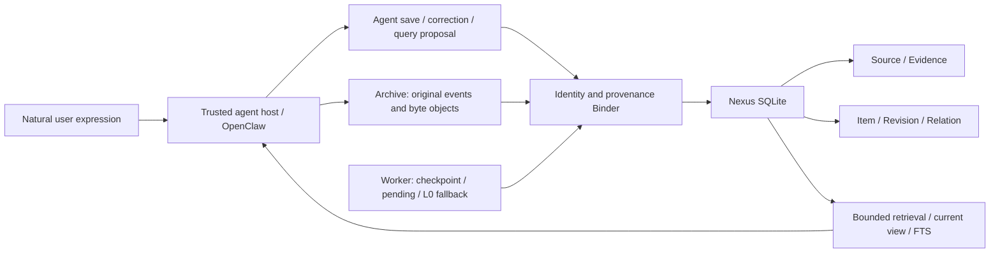

# Nexus — Personal Memory Infrastructure

**v0.1.0 · MIT · [中文](README.md)**

Nexus persists long-term memory and personal records for AI agents. This first public release extracts general code from an actively used personal system into an independent reference implementation. No production database, private configuration, conversations, or Archive corpus is included.

Users express information naturally; an agent proposes records. Nexus verifies trusted sources, preserves original text and evidence, appends revisions, links records, and retrieves bounded results. The storage service makes no LLM or embedding calls. Quick start uses newly invented data in temporary directories.

## Why long-term personal AI memory?

Conversation context grows, gets compressed, and resets. Summaries can lose exact wording, provenance, dates, and corrections. Memory documents help retain preferences, but rarely answer “which original message supports this amount?”, “what was the previous value?”, or “which record versions supported this summary?”

Nexus separates durable records from the current chat: stable identities, immutable sources, evidence per revision, current projections, and bounded retrieval. AI inference, plans, hearsay, and feelings retain their attribution. No match does not imply something never happened.

## Design principles

- Original evidence precedes structured interpretation; OCR/vision is derived information, not original image bytes.
- Updates append revisions; each item points to its current head without overwriting history.
- Event dates differ from message receipt dates; unknown dates remain unknown.
- Relations belong to revisions. Money uses integer minor units, with booked, quote, budget, and commitment kept separate.
- Success means a committed transaction. Pending and verbatim fallback do not imply complete structured extraction.
- Life, Work, Health, and Unclassified are fixed domains. Health defaults to restricted and is withheld from ordinary queries.

## Architecture



Archive preserves events, attachment bytes, and hashes. Nexus stores structured records and evidence links. The AI agent interprets language and composes answers. This repository includes Archive readers, integrity contracts, and a fictional producer; it does not include the full Archive collection daemon or any production corpus.

OpenClaw-specific components are `index.ts`, `binding.py`, `transcript.py`, and transcript scanning in the worker. Storage, revision semantics, evidence validation, transactions, dossiers, and queries can be reused by other agents with a trusted host/archive adapter. A model must never supply its own identity or provenance. See [integration](docs/integration.md).

## Data model

| Structure | Purpose |
|---|---|
| `source` | Immutable original text, content hash, event identity, Archive hashes, selectors |
| `item` | Stable ID and current head revision |
| `revision` | Version, parent, body/payload, domain, assertion attributes, status, hash |
| `evidence` | Revision-to-source exact text span and supports/corrects/context/contradicts role |
| `relation` | Versioned object links: `for_group`, `summary_of`, legacy `for_trip` |
| `entity_alias` | Aliases per entity revision; lookup without automatic person merging |
| `operation` | Idempotency key, request hash, committed result |
| `task_detail` | open/done/cancelled/paused and original due expression |
| `financial_detail` | Integer amount, currency/scale, direction, entry class |
| `schedule_detail` | Original time expression and supported dates; cancellation adds a deleted revision |
| `pending_intent` / `origin_item` / `worker_checkpoint` | Persistent retries, fallback upgrade identity, scan watermark |
| `group_context` / `summary_manifest` / `migration` | 24-hour conversation dossier context, exact summary member versions, migration checksums |

[Schema details](docs/data-model.md). The SQL file is base schema v1; `groups.py` and `completion.py` add v2/v3 tables. Database migration numbers are independent of release v0.1.0.

## Save and correction flow

1. The trusted host persists the inbound event; Archive preserves the original event and attachments.
2. The agent proposes save/update/query arguments using six fixed tools without source identity fields.
3. Binder verifies owner, agent, account, direct conversation, session, exact tool-call ancestry, and Archive hashes.
4. `BEGIN IMMEDIATE` atomically writes source, revision, evidence, relations, details, and operation. Failure rolls back the batch.
5. Receipts reflect actual commit state. Unpersisted sources enter bounded retries. Explicit recording prefixes permit L0 verbatim fallback; subsequent structuring upgrades the same item.
6. Corrections require item ID, expected revision, and reason. Old versions and evidence survive; current totals use active detail rows.

## Retrieval

The tools are `nexus_save`, `nexus_update`, `nexus_search`, `nexus_query`, `nexus_get_source`, and the preview-only `nexus_delete_preview`.

The current tool search primarily uses bounded substring queries. The base storage also maintains FTS5 trigram and exposes `Nexus.search()`. Dossier and period queries provide counts, pages, and snapshot cursors invalidated by record changes. Financial totals include all matching current members, independently of expanded pages. Text summaries bind exact member revisions and become stale when those change. Archive history expands only a few verified original excerpts. No vector semantic retrieval engine is included.

## Entirely fictional example

Starbay Island / 星湾岛 is invented for this project. Every utterance, date, amount, channel identity, and metadata value is newly authored:

- A fictional trip on April 12, 2030 creates a Source, Evidence, and dossier Item.
- “Lunch during the Starbay Island trip cost 42 yuan” creates an Item, revision 1, 4200 minor units, and a `for_group` relation.
- A blue-kite journal entry uses a second fictional channel and the same database.
- “Lunch was 38 yuan, not 42” appends revision 2 with correction evidence; the old amount remains in history.
- Retrieval returns paginated records, provenance, relations, a current total of 3800, and a stale earlier summary.

[`scripts/demo.py`](scripts/demo.py) generates isolated transcript and Archive fixtures and exercises the actual Binder/Core. It prints evidence, revisions, relations, and retrieval, then deletes temporary data. Proposals are manually authored; the demo does not call an LLM or demonstrate automatic extraction.

## Quick start

Python 3.10+, SQLite with JSON and FTS5 trigram (SQLite 3.34+). Worker and backup use POSIX `fcntl`; native Windows operation is unverified. Demo and tests need no third-party Python packages.

```sh
git clone https://github.com/yyyx5/nexus-personal-memory.git
cd nexus-personal-memory
python3 -B scripts/demo.py
python3 -B -m unittest discover -s tests -v
python3 -B scripts/privacy_audit.py
```

Expected demo integrity result: `errors: []`. The corrected fictional lunch totals 3800 minor units. Tests cover both channel contracts, identity rejection, tampering, fallback upgrades, restart recovery, transaction rollback, idempotency conflicts, history, health filtering, pagination, and verified backup restoration.

## Configuration

`config/settings.example.json` denies access by default with empty owner lists. Put real settings outside this repository at an isolated runtime root's `state/settings.json`; the database lives at `data/nexus.sqlite3`. `sourceDB` is the host transcript SQLite and `archiveRoot` the compatible Archive, both absolute paths. `agent` and `account` are checked independently; owner identities are channel-specific.

The OpenClaw adapter requires `NEXUS_ROOT`, optionally `NEXUS_PYTHON`. Compressed transcript events require system libzstd, optionally located through `NEXUS_ZSTD_LIBRARY`; plaintext demo does not. The template is not a one-command production deployment. See [integration](docs/integration.md) for initialization watermarks and acceptance checks. Never overwrite an existing production directory or automatically structure all past conversations.

## Privacy

No runtime databases, WAL/SHM, Archive text, evidence corpus, attachments, logs, backups, `.env`, owner lists, or private settings belong in Git. Keep runtime data outside the checkout. SQLite files use mode 0600 and process umask 077; host sources open read-only/query-only. Models cannot provide source paths or identity fields.

SQLite triggers prevent in-place edits through ordinary writes and hashes detect inconsistency; this is not encryption, signing, or tamper-proof protection against the database owner. Restricted visibility is an application query policy, not encryption. Health, intent, grouping, and date checks contain heuristics. This is a trusted single-person local system, not a ready multi-tenant public service. See [privacy audit](docs/privacy.md).

## Current capabilities and limits

**Implemented and tested with fictional fixtures:** source/evidence/revision/relations, batch transactions, idempotency, optimistic concurrency, verbatim fallback, pending restart recovery, shared two-channel storage and owner rejection, dossier pagination, integer financial totals, stale summary detection, FTS, verified SQLite backup and restoration.

**Experimental / integration acceptance required:** OpenClaw SDK entry, host-specific tool ancestry, AI extraction and image-derived fields, Chinese intent/grouping heuristics, bounded Archive history, fixed legacy spreadsheet selectors. The adapter originates from a deployed system; this edition passes local official SDK loading and two-channel mock registration, but has not been installed into a live OpenClaw instance or newly tested with real channels.

**Limits:** no standalone natural-language parser, UI, automatic reminders, generic importer, automatic entity merging, database encryption, or vector database. Missing originals cannot be recreated. Long chats can still incur large context and multiple model rounds. Archive history scans files and has no proven large-scale performance. Prompts and receipts are mainly Chinese; an English README does not imply full English runtime support.

## Layout

```text
nexus/      Python core, OpenClaw adapter, fixed tool definitions
schema/     Base SQLite schema and Archive JSON contract
docs/       Data model, integration, privacy, provenance, synchronization
examples/   Newly invented event/archive producer
config/     Default-deny configuration example
tests/      Isolated functional and security regressions
scripts/    Demo and file/staging/history privacy audit
```

## Roadmap

Clearer host adapters, configurable language/timezone policies, a separate Archive collector package, broader integration testing, generic import selectors, optional semantic retrieval and UI. These are plans, not v0.1.0 features.

## Contributing

Use reproducible invented cases and meaningful tests. Never upload personal data, credentials, real screenshots, or conversations in issues, PRs, or fixtures. Follow [CONTRIBUTING.md](CONTRIBUTING.md) and extraction/synchronization guidance. Private production tests and acceptance artifacts are not distributed.

## License

[MIT](LICENSE). OpenClaw and libzstd are external dependencies, with their own licenses; their source is not bundled. See [provenance](docs/provenance.md).
